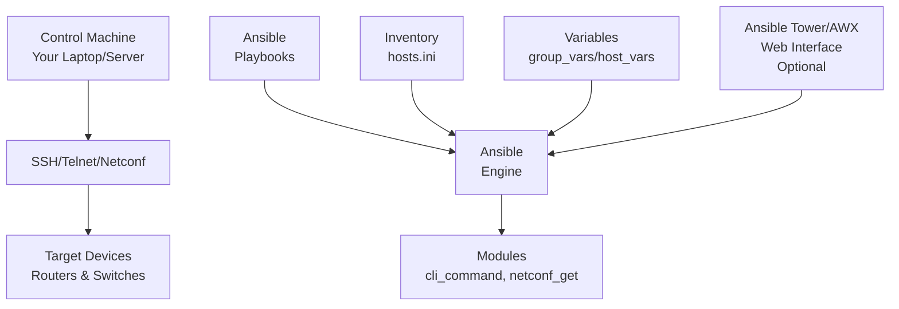
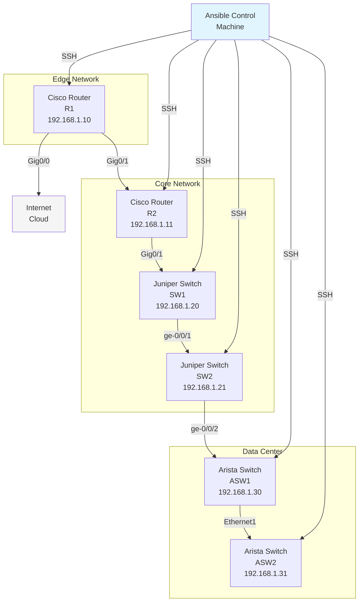

# Ansible for Network Engineers: A Beginner's Guide

## Introduction to Ansible

### What is Ansible?

Ansible is an open-source automation tool that simplifies IT orchestration, configuration management, and application deployment. For network engineers, Ansible provides a powerful way to automate repetitive network tasks, manage device configurations, and ensure consistent network operations across large-scale infrastructures.

### Why Ansible for Network Engineers?

Network engineers often face challenges like:
- **Manual Configuration**: Time-consuming CLI commands on hundreds of devices
- **Configuration Drift**: Inconsistent configurations across network devices
- **Lack of Version Control**: No history of configuration changes
- **Error-Prone Tasks**: Human errors during bulk configuration changes

Ansible solves these problems by:
- **Agentless Architecture**: No software installation required on network devices
- **Declarative Automation**: Describe desired state, Ansible handles execution
- **Idempotent Operations**: Safe to run multiple times without unintended changes
- **Multi-Vendor Support**: Works with Cisco, Juniper, Arista, Nokia, and more

### Ansible Architecture Overview



## Installing Ansible

### System Requirements

- **Control Machine**: Linux, macOS, or Windows (via WSL)
- **Python**: Version 3.8 or newer
- **Network Access**: SSH/telnet access to network devices

### Installation on Linux (Ubuntu/Debian)

```bash
# Update package lists
sudo apt update

# Install Python and pip
sudo apt install python3 python3-pip -y

# Install Ansible using pip (recommended)
pip3 install ansible

# Verify installation
ansible --version
```

### Installation on macOS

```bash
# Using Homebrew
brew install ansible

# Using pip
pip3 install ansible

# Verify installation
ansible --version
```

### Installation on Windows (WSL)

```bash
# Install WSL first, then use Linux commands above
# Or use pip directly in Windows
pip install ansible
```

### Post-Installation Configuration

```bash
# Create Ansible directory structure
mkdir -p ~/ansible/{inventory,playbooks,roles}
cd ~/ansible

# Generate SSH key for passwordless authentication
ssh-keygen -t rsa -b 2048 -f ~/.ssh/id_rsa_ansible

# Test installation
ansible localhost -m ping
```

## Ansible Components for Network Engineers

### 1. Inventory File

The inventory file defines which devices Ansible will manage.

**Basic Inventory Structure (`hosts.ini`):**
```ini
[cisco_routers]
R1 ansible_host=192.168.1.10
R2 ansible_host=192.168.1.11

[juniper_switches]
SW1 ansible_host=192.168.1.20
SW2 ansible_host=192.168.1.21

[arista_switches]
ASW1 ansible_host=192.168.1.30
ASW2 ansible_host=192.168.1.31

[routers:children]
cisco_routers
juniper_switches

[network_devices:children]
routers
arista_switches
```

### 2. Playbooks

Playbooks are YAML files that define automation tasks.

**Basic Playbook Structure:**
```yaml
---
- name: Network Device Configuration
  hosts: network_devices
  connection: network_cli
  gather_facts: no

  tasks:
    - name: Run show command
      ios_command:
        commands: show version
      register: output

    - name: Debug output
      debug:
        msg: "{{ output.stdout_lines }}"
```

### 3. Variables

Variables allow customization of playbooks.

**Group Variables (`group_vars/cisco_routers.yml`):**
```yaml
ansible_network_os: ios
ansible_user: admin
ansible_password: "{{ vaulted_password }}"
ansible_connection: network_cli
ansible_become: yes
ansible_become_method: enable
enable_password: "{{ vaulted_enable_pass }}"

# Device-specific variables
logging_server: 192.168.1.100
snmp_community: public
```

**Host Variables (`host_vars/R1.yml`):**
```yaml
hostname: Router-1
loopback_ip: 10.1.1.1
management_ip: 192.168.1.10
interfaces:
  - name: GigabitEthernet0/0
    ip: 172.16.1.1
    mask: 255.255.255.0
  - name: GigabitEthernet0/1
    ip: 172.16.2.1
    mask: 255.255.255.0
```

### 4. Modules

Ansible modules are reusable units of code.

**Common Network Modules:**
- `cli_command`: Execute CLI commands
- `netconf_get`: Retrieve NETCONF data
- `netconf_config`: Configure via NETCONF
- `command`: Execute commands on control machine

### 5. Facts and Facts Gathering

Facts are information Ansible collects about target devices.

```yaml
---
- name: Gather facts
  hosts: cisco_routers
  gather_facts: no

  tasks:
    - name: Gather network device facts
      ios_facts:
      register: ios_facts

    - name: Display facts
      debug:
        msg: |
          Device: {{ ios_facts.ansible_net_hostname }}
          OS Version: {{ ios_facts.ansible_net_version }}
          Uptime: {{ ios_facts.ansible_net_uptime }}
```

## Sample Network Topology

Our demo topology includes multiple vendor devices connected in a typical enterprise network:



## Sample Playbooks

### Inventory File (hosts.ini)

```ini
[control_machine]
ansible ansible_host=127.0.0.1 ansible_connection=local

[cisco_routers]
R1 ansible_host=192.168.1.10
R2 ansible_host=192.168.1.11

[juniper_switches]
SW1 ansible_host=192.168.1.20
SW2 ansible_host=192.168.1.21

[arista_switches]
ASW1 ansible_host=192.168.1.30
ASW2 ansible_host=192.168.1.31

[network_devices:children]
cisco_routers
juniper_switches
arista_switches
```

### Group Variables (group_vars/cisco_routers.yml)

```yaml
ansible_network_os: ios
ansible_user: cisco
ansible_password: ciscopassword
ansible_connection: network_cli
ansible_become: yes
ansible_become_method: enable
enable_password: enablepassword

logging_host: 192.168.1.100
snmp_community: networkmonitoring
```

### 1. Show Commands Playbook

This playbook demonstrates running show commands across different vendors.

```yaml
---
- name: Network Device Show Commands
  hosts: network_devices
  connection: network_cli
  gather_facts: no

  tasks:
    - name: Show version - Cisco
      ios_command:
        commands: show version | include Version
      register: version_output
      when: "'cisco_routers' in group_names"

    - name: Show version - Juniper
      junos_command:
        commands: show version | match hostname
      register: version_output
      when: "'juniper_switches' in group_names"

    - name: Show version - Arista
      eos_command:
        commands: show version | include Software
      register: version_output
      when: "'arista_switches' in group_names"

    - name: Display version information
      debug:
        msg: |
          Device: {{ inventory_hostname }}
          Version Info: {{ version_output.stdout_lines[0] | join(' ') }}

    - name: Show interfaces - Cisco
      ios_command:
        commands: show ip interface brief
      register: int_output
      when: "'cisco_routers' in group_names"

    - name: Show interfaces - Juniper
      junos_command:
        commands: show interfaces terse
      register: int_output
      when: "'juniper_switches' in group_names"

    - name: Show interfaces - Arista
      eos_command:
        commands: show ip interface brief
      register: int_output
      when: "'arista_switches' in group_names"

    - name: Display interface information
      debug:
        msg: "{{ int_output.stdout_lines }}"
```

**Sample Execution Output:**

```bash
$ ansible-playbook show_commands.yml -i hosts.ini

PLAY [Network Device Show Commands] ***************************

TASK [Show version - Cisco] **********************************
ok: [R1]
ok: [R2]

TASK [Show version - Juniper] *******************************
ok: [SW1]
ok: [SW2]

TASK [Show version - Arista] ********************************
ok: [ASW1]
ok: [ASW2]

TASK [Display version information] **************************
ok: [R1] => {
    "msg": "Device: R1\nVersion Info: Cisco IOS Software, IOSv Software (VIOS-ADVENTERPRISEK9-M), Version 15.7(3)M3"
}
ok: [R2] => {
    "msg": "Device: R2\nVersion Info: Cisco IOS Software, IOSv Software (VIOS-ADVENTERPRISEK9-M), Version 15.7(3)M3"
}
ok: [SW1] => {
    "msg": "Device: SW1\nVersion Info: Hostname: SW1-core"
}
ok: [SW2] => {
    "msg": "Device: SW2\nVersion Info: Hostname: SW2-edge"
}
ok: [ASW1] => {
    "msg": "Device: ASW1\nVersion Info: Arista EOS Software, Version 4.25.4M"
}
ok: [ASW2] => {
    "msg": "Device: ASW2\nVersion Info: Arista EOS Software, Version 4.25.4M"
}

TASK [Show interfaces - Cisco] *****************************
ok: [R1]
ok: [R2]

TASK [Show interfaces - Juniper] ***************************
ok: [SW1]
ok: [SW2]

TASK [Show interfaces - Arista] ****************************
ok: [ASW1]
ok: [ASW2]

TASK [Display interface information] ***********************
ok: [R1] => {
    "msg": [
        "Interface                  IP-Address      OK? Method Status                Protocol",
        "GigabitEthernet0/0         192.168.1.1     YES manual up                    up",
        "GigabitEthernet0/1         unassigned      YES NVRAM  up                    up",
        "GigabitEthernet0/2         10.1.1.1        YES manual up                    up"
    ]
}
ok: [SW1] => {
    "msg": [
        "Interface               Admin Link Proto    Local                 Remote",
        "cbp0                    up    up",
        "demux0                  up    up",
        "dsc                     up    up",
        "em0                     up    up   inet     10.0.0.1/8",
        "em1                     up    down",
        "ge-0/0/0               up    down",
        "ge-0/0/1               up    up   inet     192.168.1.20/24"
    ]
}
ok: [ASW1] => {
    "msg": [
        "Interface              IP Address         Status     Protocol         MTU    Owner",
        "Management1            192.168.1.30/24   up         up              1500",
        "Ethernet1              unassigned         down       down            1500",
        "Ethernet2              172.16.1.1/24     up         up              1500"
    ]
}

PLAY RECAP **************************************************
R1          : ok=3    changed=0    unreachable=0    failed=0
R2          : ok=3    changed=0    unreachable=0    failed=0
SW1         : ok=3    changed=0    unreachable=0    failed=0
SW2         : ok=3    changed=0    unreachable=0    failed=0
ASW1        : ok=3    changed=0    unreachable=0    failed=0
ASW2        : ok=3    changed=0    unreachable=0    failed=0
```

### 2. Configuration Pull Playbook

This playbook collects configurations from network devices and saves them locally.

```yaml
---
- name: Network Device Configuration Backup
  hosts: network_devices
  connection: network_cli
  gather_facts: no

  tasks:
    - name: Create backup directory
      file:
        path: "./backups/{{ inventory_hostname }}"
        state: directory
      delegate_to: localhost
      run_once: true

    - name: Backup Cisco running configuration
      ios_command:
        commands: show running-config
      register: config_output
      when: "'cisco_routers' in group_names"

    - name: Backup Juniper configuration
      junos_command:
        commands: show configuration | display set
      register: config_output
      when: "'juniper_switches' in group_names"

    - name: Backup Arista running configuration
      eos_command:
        commands: show running-config
      register: config_output
      when: "'arista_switches' in group_names"

    - name: Save configuration to file
      copy:
        content: |
          # Configuration backup for {{ inventory_hostname }}
          # Date: {{ ansible_date_time.iso8601 }}
          # Device: {{ inventory_hostname }}
          {{ config_output.stdout[0] | default(config_output.stdout_lines | join('\n')) }}
        dest: "./backups/{{ inventory_hostname }}/{{ inventory_hostname }}_{{ ansible_date_time.iso8601 }}.cfg"
      delegate_to: localhost

    - name: Git add and commit backup
      shell: |
        cd backups
        git add {{ inventory_hostname }}/{{ inventory_hostname }}_{{ ansible_date_time.iso8601 }}.cfg
        git commit -m "Backup {{ inventory_hostname }} configuration"
      delegate_to: localhost
      run_once: true
      ignore_errors: yes
```

**Sample Execution Output:**

```bash
$ ansible-playbook config_backup.yml -i hosts.ini

PLAY [Network Device Configuration Backup] *******************

TASK [Create backup directory] *******************************
ok: [R1 -> localhost]

TASK [Backup Cisco running configuration] ********************
ok: [R1]
ok: [R2]

TASK [Backup Juniper configuration] **************************
ok: [SW1]
ok: [SW2]

TASK [Backup Arista running configuration] ******************
ok: [ASW1]
ok: [ASW2]

TASK [Save configuration to file] ****************************
ok: [R1 -> localhost] =>
  "path": "/home/ansible/backups/R1/R1_2023-08-15T14-30-45.cfg",
  "size": 3456
ok: [R2 -> localhost] =>
  "path": "/home/ansible/backups/R2/R2_2023-08-15T14-30-45.cfg"
ok: [SW1 -> localhost] =>
  "path": "/home/ansible/backups/SW1/SW1_2023-08-15T14-30-45.cfg"
ok: [SW2 -> localhost] =>
  "path": "/home/ansible/backups/SW2/SW2_2023-08-15T14-30-45.cfg"
ok: [ASW1 -> localhost] =>
  "path": "/home/ansible/backups/ASW1/ASW1_2023-08-15T14-30-45.cfg"
ok: [ASW2 -> localhost] =>
  "path": "/home/ansible/backups/ASW2/ASW2_2023-08-15T14-30-45.cfg"

TASK [Git add and commit backup] *****************************
changed: [R1 -> localhost]

PLAY RECAP **************************************************
R1          : ok=5    changed=0    unreachable=0    failed=0
R2          : ok=4    changed=0    unreachable=0    failed=0
SW1         : ok=4    changed=0    unreachable=0    failed=0
SW2         : ok=4    changed=0    unreachable=0    failed=0
ASW1        : ok=4    changed=0    unreachable=0    failed=0
ASW2        : ok=4    changed=0    unreachable=0    failed=0
```

**Sample Backup File Content (R1.cfg created):**

```text
# Configuration backup for R1
# Date: 2023-08-15T14:30:45+00:00
# Device: R1
Building configuration...

Current configuration : 3456 bytes
!
! Last configuration change at 14:25:30 UTC Wed Aug 15 2023 by ansible
!
version 15.7
service timestamps debug datetime msec
service timestamps log datetime msec
!
hostname R1
!
boot-start-marker
boot-end-marker
!
!
username cisco privilege 15 secret 9 $9$ABCDEFGHIJK
!
!
interface GigabitEthernet0/0
 ip address 192.168.1.1 255.255.255.0
 duplex auto
 speed auto
 media-type rj45
!
interface GigabitEthernet0/1
 no ip address
 shutdown
 duplex auto
 speed auto
 media-type rj45
!
interface GigabitEthernet0/2
 ip address 10.1.1.1 255.255.255.0
 duplex auto
 speed auto
 media-type rj45
!
router ospf 1
 network 10.1.1.0 0.0.0.255 area 0
!
ip default-gateway 192.168.1.254
ip http server
ip http authentication local
ip http secure-server
!
!
line con 0
 exec-timeout 0 0
 privilege level 15
 logging synchronous
line aux 0
 exec-timeout 0 0
 privilege level 15
 logging synchronous
line vty 0 4
 privilege level 15
 logging synchronous
 transport input ssh
!
end
```

**Sample Backup File Content (SW1.cfg created - Juniper set format):**

```bash
# Configuration backup for SW1
# Date: 2023-08-15T14:30:45+00:00
# Device: SW1
set version 18.3R3-S4.5
set system host-name SW1-core
set system root-authentication encrypted-password "$6$abcdefghijklmnop"
set system login user ansible uid 2001
set system login user ansible class super-user
set system login user ansible authentication encrypted-password "$6$qrstuvwxyz123"
set system services ssh
set system services netconf ssh
set system syslog archive size 100k
set system syslog archive files 5
set interfaces ge-0/0/1 unit 0 family inet address 192.168.1.20/24
set interfaces ge-0/0/1 unit 0 family inet address 192.168.2.20/24
set interfaces lo0 unit 0 family inet address 10.0.0.1/32
set protocols ospf area 0.0.0.0 interface ge-0/0/1.0
set protocols ospf area 0.0.0.0 interface lo0.0 passive
set protocols lldp interface all
set routing-options router-id 10.0.0.1
```

### 3. Configuration Push Playbook

This playbook pushes configuration changes to network devices.

```yaml
---
- name: Network Device Configuration Updates
  hosts: network_devices
  connection: network_cli
  gather_facts: no

  vars:
    new_hostname: "{{ inventory_hostname }}_updated"

  tasks:
    - name: Backup current configuration (Cisco)
      ios_command:
        commands: show running-config
      register: current_config
      when: "'cisco_routers' in group_names"

    - name: Update hostname - Cisco
      ios_config:
        lines:
          - hostname {{ new_hostname }}
        save_when: changed
      when: "'cisco_routers' in group_names"

    - name: Configure logging server - Cisco
      ios_config:
        lines:
          - logging host {{ logging_host }}
        save_when: changed
      when: "'cisco_routers' in group_names"

    - name: Configure SNMP - Cisco
      ios_config:
        lines:
          - snmp-server community {{ snmp_community }} RO
        save_when: changed
      when: "'cisco_routers' in group_names"

    - name: Update hostname - Juniper
      junos_config:
        lines:
          - set system host-name {{ new_hostname }}
      when: "'juniper_switches' in group_names"

    - name: Configure logging server - Juniper
      junos_config:
        lines:
          - set system syslog host {{ logging_host }} any any
      when: "'juniper_switches' in group_names"

    - name: Configure SNMP - Juniper
      junos_config:
        lines:
          - set snmp community {{ snmp_community }} authorization read-only
      when: "'juniper_switches' in group_names"

    - name: Update hostname - Arista
      eos_config:
        lines:
          - hostname {{ new_hostname }}
        save_when: changed
      when: "'arista_switches' in group_names"

    - name: Configure logging server - Arista
      eos_config:
        lines:
          - logging host {{ logging_host }}
        save_when: changed
      when: "'arista_switches' in group_names"

    - name: Configure SNMP - Arista
      eos_config:
        lines:
          - snmp-server community {{ snmp_community }} ro
        save_when: changed
      when: "'arista_switches' in group_names"

    - name: Verify configuration
      pause:
        prompt: "Verify the changes before continuing?"
        seconds: 30

    - name: Save configuration - Cisco
      ios_command:
        commands: write memory
      when: "'cisco_routers' in group_names"

    - name: Save configuration - Juniper
      junos_command:
        commands: commit
      when: "'juniper_switches' in group_names"

    - name: Save configuration - Arista
      eos_command:
        commands: write memory
      when: "'arista_switches' in group_names"
```

**Sample Execution Output:**

```bash
$ ansible-playbook config_push.yml -i hosts.ini

PLAY [Network Device Configuration Updates] ******************

TASK [Backup current configuration (Cisco)] ******************
ok: [R1]
ok: [R2]

TASK [Update hostname - Cisco] *******************************
changed: [R1]
changed: [R2]

TASK [Configure logging server - Cisco] *********************
changed: [R1]
changed: [R2]

TASK [Configure SNMP - Cisco] *******************************
ok: [R1]
ok: [R2]

TASK [Update hostname - Juniper] *****************************
changed: [SW1]
changed: [SW2]

TASK [Configure logging server - Juniper] *******************
changed: [SW1]
changed: [SW2]

TASK [Configure SNMP - Juniper] *****************************
changed: [SW1]
changed: [SW2]

TASK [Update hostname - Arista] *****************************
changed: [ASW1]
changed: [ASW2]

TASK [Configure logging server - Arista] *******************
ok: [ASW1]
ok: [ASW2]

TASK [Configure SNMP - Arista] *****************************
ok: [ASW1]
ok: [ASW2]

TASK [Verify configuration] *********************************
Pausing for 30 seconds
(ctrl+C then 'C' = continue early, ctrl+C then 'A' = abort)
ok: [R1]

TASK [Save configuration - Cisco] ***************************
ok: [R1]
ok: [R2]

TASK [Save configuration - Juniper] *************************
ok: [SW1]
ok: [SW2]

TASK [Save configuration - Arista] **************************
ok: [ASW1]
ok: [ASW2]

PLAY RECAP **************************************************
R1          : ok=9    changed=3    unreachable=0    failed=0
R2          : ok=8    changed=3    unreachable=0    failed=0
SW1         : ok=8    changed=3    unreachable=0    failed=0
SW2         : ok=8    changed=3    unreachable=0    failed=0
ASW1        : ok=8    changed=1    unreachable=0    failed=0
ASW2        : ok=8    changed=1    unreachable=0    failed=0
```

**Verification of Changes (post-playbook commands):**

```bash
# Verify Cisco hostnames changed
$ ansible cisco_routers -m ios_command -a "commands='show running-config | include hostname'" -i hosts.ini

R1 | CHANGED | rc=0 >>
hostname R1_updated

R2 | CHANGED | rc=0 >>
hostname R2_updated

# Verify Juniper hostnames changed
